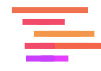
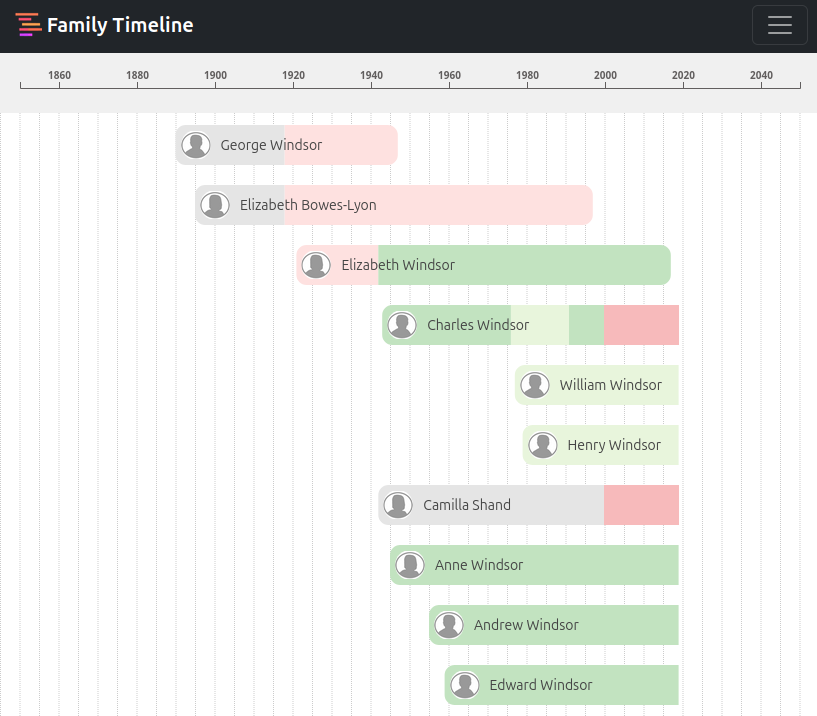

# Family Timeline

Manage your family data with timeline approach.



Supported languages:
- [x] English
- [x] Français



## Quick start

The recommanded way to start this application is docker compose.

Create a directory of your choice (e.g. ./familytimeline) to hold the docker-compose.yml and .env files.

```bash
mkdir ./familytimeline
cd ./familytimeline
```

Download docker-compose.yml and docker-example.env, either by running the following commands:
And update the .env file with custom values if you want

```bash
wget https://github.com/dmachard/familytimeline/releases/latest/download/docker-compose.yml
wget -O .env https://github.com/dmachard/familytimeline/releases/latest/download/docker-example.env
```

Create data folders

```bash
mkdir -p userdata/ userdata/data userdata/data/profles userdata/data/attachments
cd userdata/
```

Copy default configs

```bash
cp ../backend-server/nginx.conf .
cp ../vuejs-client/public/config.js .
```

Create empty database

```bash
sqlite3 database.sqlite3 < ../backend-server/src/utils/schema.sql
sqlite3 database.sqlite3 < ../backend-server/src/utils/user.sql
```

Start the containers using docker compose command

```bash
docker compose up -d
```

The FamilyTimeline application will be available on `http://localhost:8080/`.
The default user is `admin` with password `admin`.

## For developers

This project is based on the following frameworks
- [VueJS 3](https://vuejs.org/)
- [Boostrap 5](https://getbootstrap.com/)
- [NodeJS](https://nodejs.org/)

### Project Setup

```bash
npm install
npm run install
```

### Init demo database

```bash
cd backend-server/src/db
sqlite3 database.sqlite3 < ../utils/schema.sql
sqlite3 database.sqlite3 < ../utils/user.sql
```

Add some data

```bash
sqlite3 database.sqlite3 < ../utils/royal_family.sql
```

### Compile and run

```sh
npm start
```

The frontend is reachable  at `http://localhost:5173/`
The server side is listening on `http://localhost:5000/`

### Linter

```bash
npm run lint
```

### Test units

Execute all tests

```bash
npm run test
```

Example to execute one test

```bash
npx vitest run --environment jsdom App.test.js
```

### Docker build for server

Build image

```bash
sudo docker build . --file Dockerfile -t familytimeline-server
```

Run container

```bash
sudo docker run -d -p 5000:5000 --name familytimeline-server familytimeline-server
```

### Docker build for client

Build image

```bash
sudo docker build . --file Dockerfile -t familytimeline-client
```

Run container

```bash
sudo docker run -d -p 80:80 --name familytimeline-client familytimeline-client
```

### Build and run with docker compose 

Init data folder, database and default config for client

```bash
mkdir -p userdata/ userdata/data userdata/data/profles userdata/data/attachments
cd userdata/
```

Copy config

```bash
sqlite3 database.sqlite3 < ../backend-server/src/utils/schema.sql
sqlite3 database.sqlite3 < ../backend-server/src/utils/user.sql
cp ../backend-server/nginx.conf .
cp ../vuejs-client/public/config.js .
```

Build and deploy client, server and reverse proxy in front

```bash
sudo docker compose -f docker-compose.dev.yml up --build
```

The frontend is reachable  at `http://localhost/`
The API server is available on `http://localhost/api/`

The default user is `admin` with password `admin`.

### Hash password for default user

```bash
$ node src/utils/hashPassword.js
Hashed password: $2b$10$gz5
```